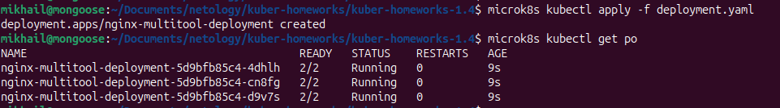
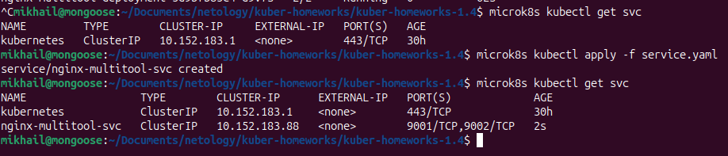
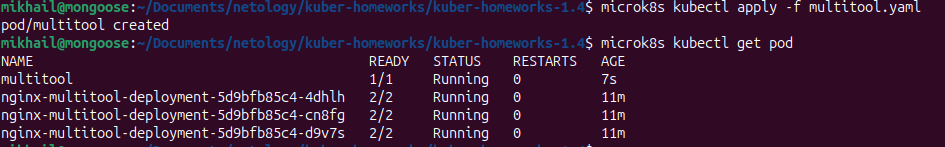
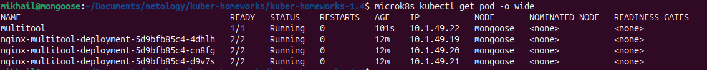
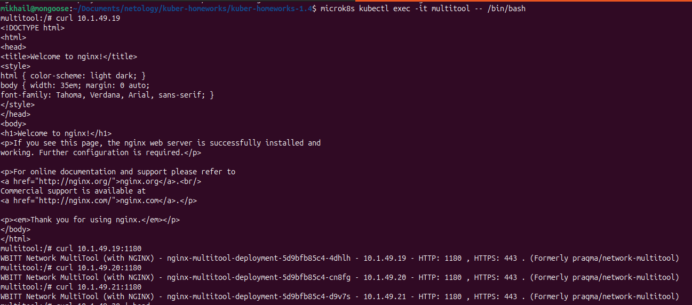
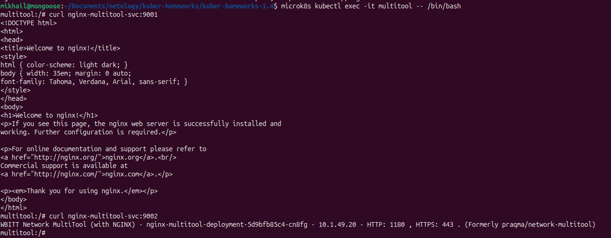

# Домашнее задание к занятию «Сетевое взаимодействие в K8S. Часть 1» -- Байков Михаил

### Задание 1. Создать Deployment и обеспечить доступ к контейнерам приложения по разным портам из другого Pod внутри кластера

1. Создать Deployment приложения, состоящего из двух контейнеров (nginx и multitool), с количеством реплик 3 шт.
2. Создать Service, который обеспечит доступ внутри кластера до контейнеров приложения из п.1 по порту 9001 — nginx 80, по 9002 — multitool 8080.
3. Создать отдельный Pod с приложением multitool и убедиться с помощью `curl`, что из пода есть доступ до приложения из п.1 по разным портам в разные контейнеры.
4. Продемонстрировать доступ с помощью `curl` по доменному имени сервиса.
5. Предоставить манифесты Deployment и Service в решении, а также скриншоты или вывод команды п.4.

#### Решение 1
1. Cоздаем манифест `deployment.yaml` инициализирующий pod из двух контейнеров: nginx и multitool, с количеством реплик 3шт. Применяем его и проверяем результат.

2. Создаем манифест сервиса `service.yaml` обеспечивающего доступность подов nginx и multitool внутри кластера по порту 9001 — nginx 80, по 9002 — multitool 8080. Применяем манифест и проверяем результат.

3. Создаем манифест `multitool.yaml` инициализирующий отдельный под с multitool. Применяем его, проверяем результат при помощи вывода команд `microk8s kubectl get pod` и `curl`.

4. Проверяем доступность подов через сервис при помощи команды `curl`.

------

### Задание 2. Создать Service и обеспечить доступ к приложениям снаружи кластера

1. Создать отдельный Service приложения из Задания 1 с возможностью доступа снаружи кластера к nginx, используя тип NodePort.
2. Продемонстрировать доступ с помощью браузера или `curl` с локального компьютера.
3. Предоставить манифест и Service в решении, а также скриншоты или вывод команды п.2.

#### Решение 2
------
